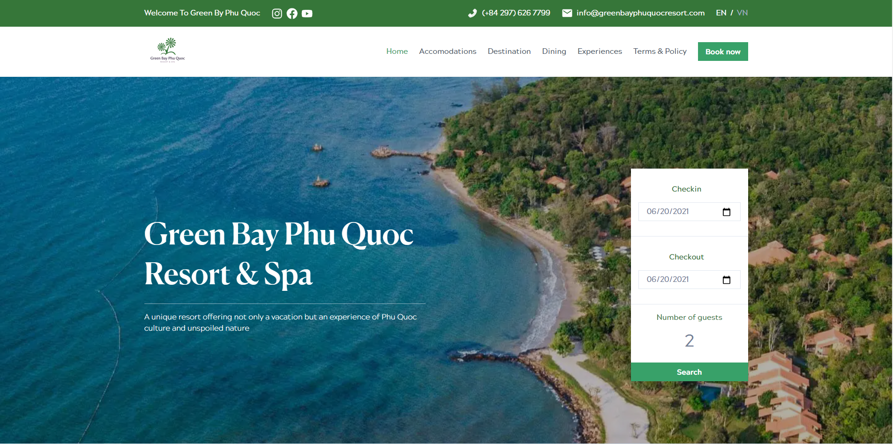
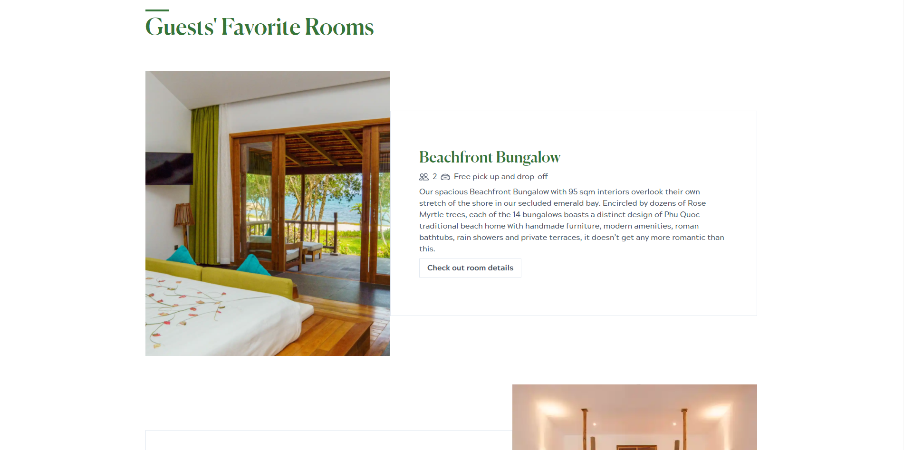
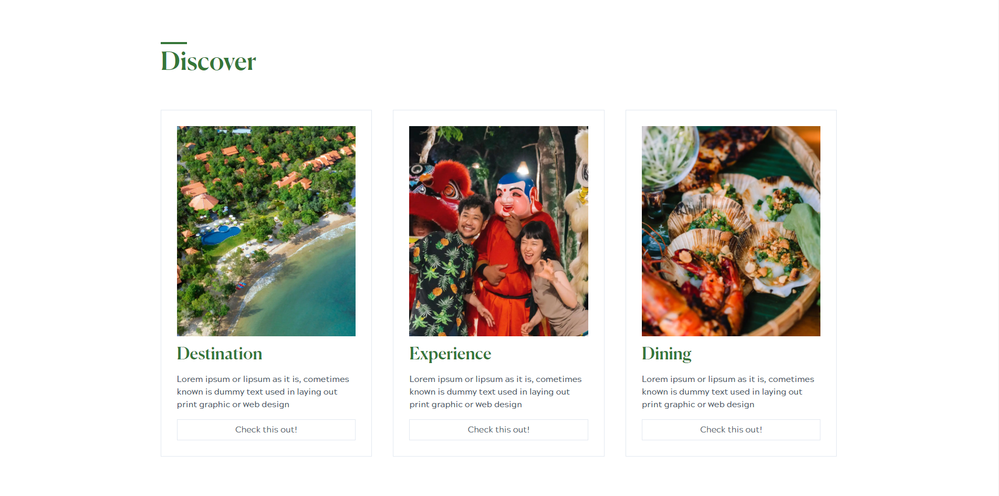

# Greenbay Phu Quoc Resort & Spa

A highly performant, modern website that I built as a freelancer for Greenbay Phu Quoc Resort & Spa.

## Project Screen Shot(s)

## Installation and Setup Instructions

#### Example:

Clone down this repository. You will need `node` and `npm` installed globally on your machine.

Installation:

`npm install`

To Start the Application in development mode:

`npm run develop`

To Visit App:

`localhost:8000`

## Reflection

The `Greenbay Phu Quoc Resort resort` already has a website, but it has become slow and difficult to maintain due to the lack of maintainers. The client has decided to create a new one and asked me to do it. This is the product that I made following the client's request.

One of the most challenging aspects of this project was `time management`. When I received the request from the client, I was only two months away from graduation, and classwork already took a lot of my time. Despite that, I also had to finish building <a href="https://www.talaria-order.xyz">Talaria Order Management System</a> for my final class at CSUF. At first, I didn't plan on agreeing to build the project due to the lack of time. However, after weighing the pros and cons of working on this project, I finally decided to accept the work. There were a couple of reasons that encouraged me to change my mind:

- **Experience**: This is an excellent project for me to gain more experience in building websites. Since this is a website for a high-class resort, it needs to look modern, eco-friendly, and it also needs to perform well due to the massive amount of visitors. There are several decisions needed to be made to satisfy those requests. Being able to build this website means that I'm one step closer to becoming a better engineer.
- **Money**: This is important too. Due to COVID-19, I have had trouble finding a job to support myself. This project would be a good source of income to pay for my living expenses.
- **Time management skill**: I realized that time management was a crucial skill, and with my schedule almost fully packed, I figured that if I could add one more thing to my to-do list, I would be getting better at my time management skill. Every day before going to bed, I had to list down what I would need to do for the next day. It wasn't easy at first, but in the end, it became more natural to do, and Fortunately, I was able to finish all of my work without sacrificing the quality of my work.
